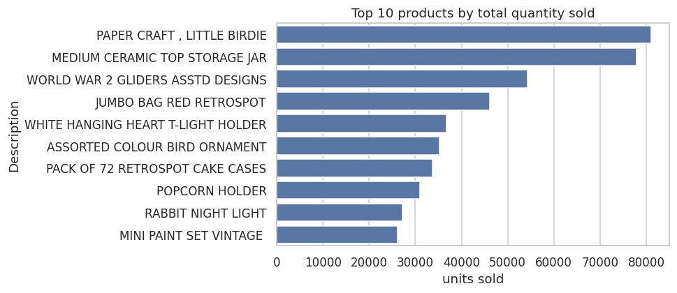
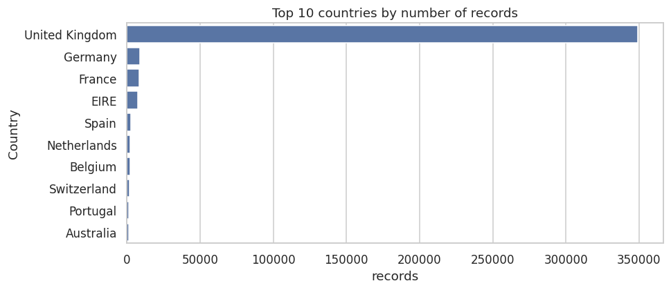
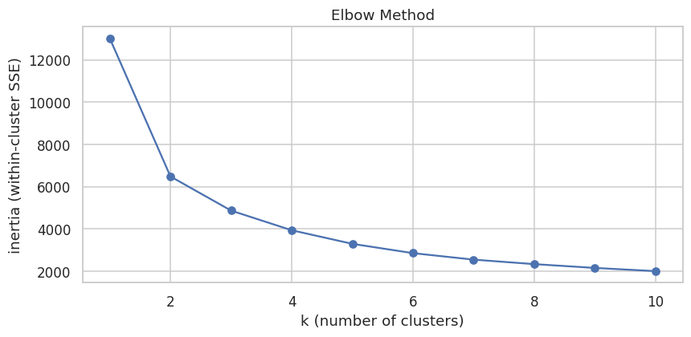
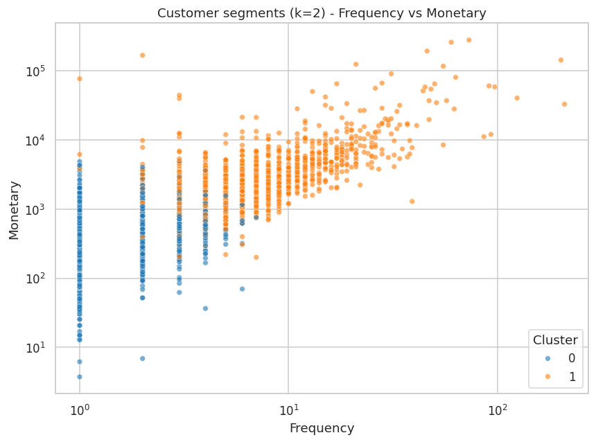
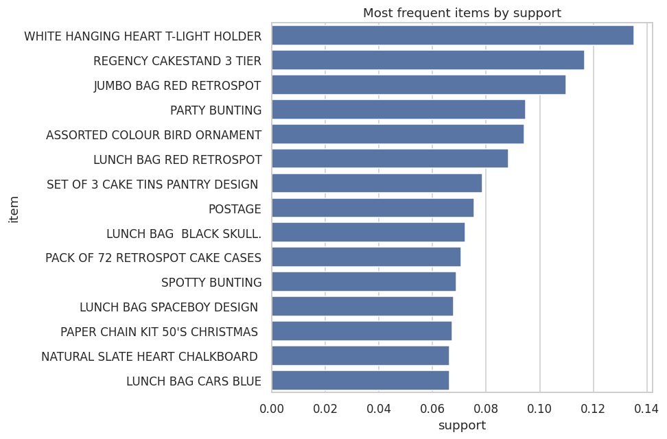

<h1>Practical Data Mining with Python</h1>

CBD-3333: Data Mining and Analysis &mdash; Assignment 1

Dataset: UCI Online Retail (541,909 transactions) &nbsp;|&nbsp; Author: Alejandro P. &nbsp;|&nbsp; June 2026

## 1. Data Preprocessing

The raw Online Retail dataset has **541,909 rows** and 8 columns (InvoiceNo, StockCode,
Description, Quantity, InvoiceDate, UnitPrice, CustomerID, Country).

<strong>Cleaning summary:</strong> dropped 135,080 rows missing <code>CustomerID</code> and
1,454 missing <code>Description</code>; removed 8,945 cancelled / non-positive rows
(invoices starting with &ldquo;C&rdquo;, and Quantity/UnitPrice &le; 0); removed 5,192 duplicates.
<strong>Final clean dataset: 392,692 rows.</strong>

- **Missing values** &mdash; rows without a customer or product description can't be used for
  clustering or basket analysis, so they were dropped.
- **Categorical &rarr; numerical** &mdash; `StockCode` and `Country` were one-hot encoded into a
  **3,702-column matrix**. This demonstrates the technique; the models themselves use behavioral
  **RFM** features (Task 2) and the **basket matrix** (Task 3), since 3,700 product columns would
  overwhelm the clustering distance metric.
- **New feature** &mdash; `TotalPrice = Quantity × UnitPrice`.
- **Normalization** &mdash; Quantity, UnitPrice and TotalPrice were standardized (mean 0, std 1)
  with `StandardScaler`.

Fig 1. Best-selling products (left) and most active countries (right). The UK dominates the data.

## 2. Customer Clustering with K-Means

Customers were described using **RFM** features &mdash; **Recency** (days since last purchase),
**Frequency** (number of invoices) and **Monetary** (total spend) &mdash; aggregating the
transactions into **4,338 customers**. RFM is heavily skewed, so features were `log1p`-transformed
and then standardized before clustering.

The **Elbow Method** and the **silhouette score** were used to choose *k*. Silhouette peaked at
**k = 2 (score 0.433)**, indicating two well-separated customer groups.

Fig 2. Elbow plot (left) and the resulting segments on Frequency vs Monetary, log scale (right).

| Cluster | Customers | Avg Recency (days) | Avg Frequency | Avg Monetary (£) | Interpretation |
|--------:|----------:|-------------------:|--------------:|-----------------:|----------------|
| 0 | 2,672 | 134 | 1.7 | 496 | **Lapsed / low-value** &mdash; bought rarely, long ago |
| 1 | 1,666 | 26 | 8.4 | 4,540 | **Loyal / high-value** &mdash; recent, frequent, big spenders |

**How businesses use this:** Cluster 1 are the most valuable customers &mdash; reward and retain them
(VIP perks, early access). Cluster 0 are at risk &mdash; target them with win-back offers and
re-engagement campaigns. Spending the marketing budget per segment is far more efficient than
treating all customers the same.

## 3. Association Rule Mining (Apriori)

Transactions were converted to **basket format** &mdash; one row per invoice, products as columns &mdash;
producing an **18,532 × 3,877 sparse matrix**.

**At the required thresholds (min_support = 0.15, min_confidence = 0.5), Apriori finds 0 frequent
itemsets and therefore 0 rules.** No single product appears in 15% of all baskets, so the threshold
is simply too high for this dataset. To surface meaningful rules, a supplementary run on the
**top-80 products** with `min_support = 0.02` produced **142 itemsets and 37 rules**.

### Top association rules (by lift)

| Antecedent | Consequent | Support | Confidence | Lift |
|------------|------------|--------:|-----------:|-----:|
| Green Regency Teacup, Cakestand 3 Tier | Roses Regency Teacup | 0.021 | 0.83 | 15.5 |
| Green Regency Teacup | Roses Regency Teacup | 0.037 | 0.78 | 14.6 |
| Spaceboy Lunch Box | Dolly Girl Lunch Box | 0.029 | 0.60 | 14.3 |
| Gardeners Kneeling Pad "Cup of Tea" | Gardeners Kneeling Pad "Keep Calm" | 0.032 | 0.73 | 14.1 |
| Alarm Clock Bakelike Green | Alarm Clock Bakelike Red | 0.036 | 0.67 | 11.2 |

Fig 3. Most frequent items by support.

### Choosing support &amp; confidence (and why not to maximize them)

- **Support** = how often an itemset appears. Set it too high and only bestsellers survive (you miss
  niche but profitable patterns); too low and you get a combinatorial explosion of noisy,
  coincidental itemsets that is slow and memory-heavy.
- **Confidence** = P(consequent | antecedent). High confidence can be *misleading* when the
  consequent is simply popular on its own &mdash; which is why rules are ranked by **lift**
  (lift &gt; 1 means a genuine positive association).
- Maximizing both yields a handful of obvious rules ("milk &rarr; bread") with little business value;
  *balancing* them surfaces useful, non-trivial co-purchase patterns.

**Business use:** the rules above (e.g. the Regency teacup set, lift 15.5) show products genuinely
bought together. Stores can place them near each other, bundle them, build "frequently bought
together" recommendations, and use a high-lift anchor product to pull its partners through a promotion.
